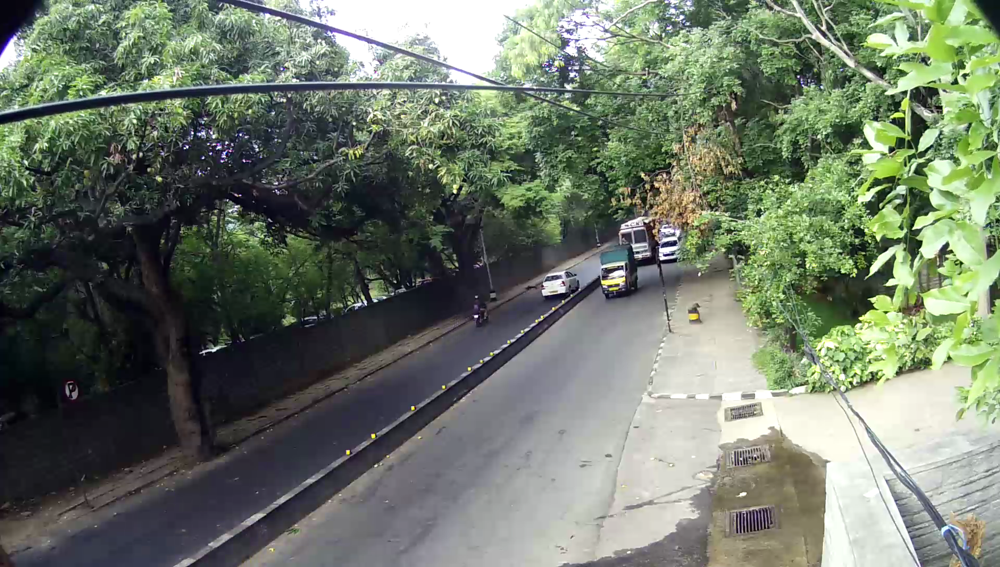
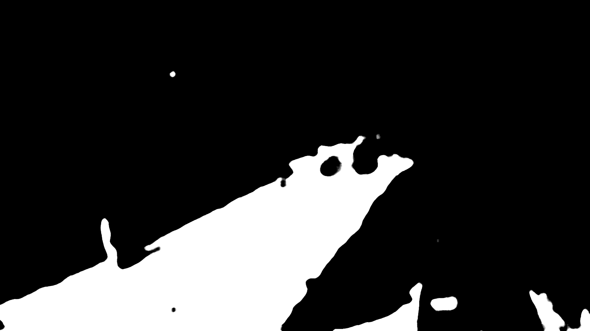
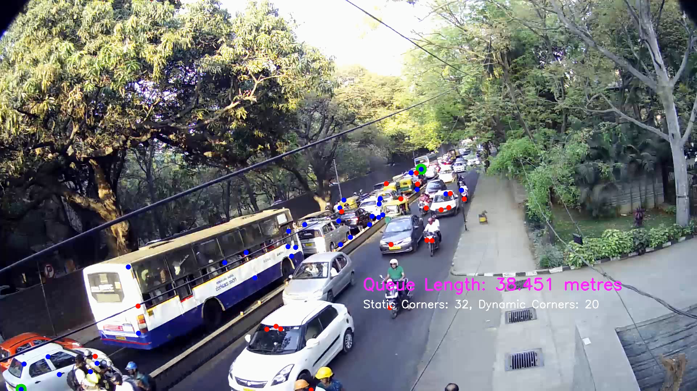

<!-- # Queue Length and density. -->

# Queue Length Estimation.

The approach is based on road segmentation using an unsupervised convolutional neural network and detecting features (Shi-Tomasi corner detection) on the segmented road. The detected corners are then segregated into static and dynamic corners. The queue length is estimated by computing the real world distance between the last and the first static feature detected on the segmented road.

Use this command to install all the necessary packages (python3).

```
pip install -r requirements.txt
```

## Unsupervised CNN segmentation. 

The CNN model iteratively refines the Felzenszwalb image segmentation that relies on the similarity between neighbouring pixels. The iterative refinement process is a joint optimization problem where an unknown number of (region) labels is first predicted which is then used to optimize the CNN-generated feature vectors and the classification algorithm. The next step is to refine the number of labels. This process is repeated until a minimum number of labels is reached or by setting a hard limit on the number of iterations. In our experiments, we used 200 iterations to achieve the segmentation.
To run the Unsupervised CNN,

 

```
python3 CNN_seg.py --input input_image.jpg --nChannel 200 --nConv 2 --maxIter 200 --output path/to/mask.jpg
```

**Note**: input_image.jpg ideally has an empty road in view.


CNN_seg.py runs till the 190th iteration when ```--maxIter``` has been specified as 200 (maxIter - 10). The CLI, then prompts the user to select the required label(s) (1-10). Sometimes, the two lanes are assigned different labels (due to lighting and what have you) so once the first label is specified, you can give the second label, if required. So now, the mask will be made of 2 separate labels from the segmented image.

## Estimation results.

The mask is overlayed on the video provided as input and features are continuosly tracked using goodFeaturesToTrack. Maximum 100 corners are detected per frame which functioned well for the test data. Corners detected are classified into static and dynamic through an algorithm specified [here](https://ieeexplore.ieee.org/document/6130484). It can be roughly summarised by checking the sorroundings of detected corners across consective frames for change in average pixel value. Once the change is above a well defined threshold (threshold is computed dynamically for each corner region, taking into account minimum and maximum pixel value in the region) the corner is defined as dynamic, otherwise, static.


```
python3 q_detections.py -p path/to/VideoOrStream -s /save_output_here.avi
```


